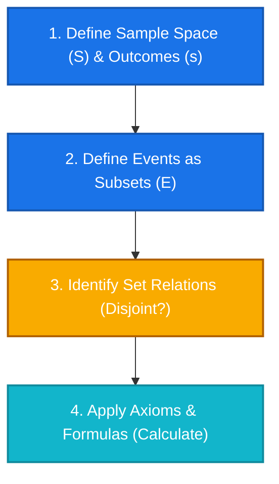

# 🛠️ Probability Modeling Workflow Manual

현실의 무작위 현상(문장제 문제)을 수학적인 확률 모델로 변환하여 기계적으로 해결하기 위한 표준 4단계 알고리즘 가이드임.

---

## 📌 Standard 4-Step Workflow

### 1단계: 표본 공간 ($S$)과 결과 ($s$) 정의
* **할 일**: 관찰하는 실험의 가장 기본적이고 쪼갤 수 없는 개별 결과(Outcome)를 소문자 $s$ (또는 $\omega$)로 명명하고, 이들의 전체집합인 표본 공간 $S$ (또는 $\Omega$)를 설정함.
* **약어**: Outcomes ($s \in S$), Sample Space ($S$ 또는 $\Omega$)
* **핵심 직관**: 여러 날이나 여러 회차에 걸친 관찰의 경우, $s$는 자연스럽게 **순서쌍/튜플(Tuple)**의 형태를 가짐.
  > [!TIP]
  > 곱집합(Cartesian Product) $A \times B$ 개념을 활용하면 다단계 실험의 표본 공간 $S$를 튜플의 집합으로 쉽게 정의할 수 있음.

### 2단계: 사건 (Events) 정의
* **할 일**: 확률을 계산하고 싶은 관심 대상(시나리오)을 표본 공간 $S$의 부분집합(Subset)인 사건 $E$로 정의함.
* **약어**: Event ($E \subset S$)
* **표기법**: 조건제시법 $E = \{ s \in S \mid s\text{의 조건} \}$ 또는 원소나열법을 사용하여 엄밀한 집합으로 나타냄.
  > [!IMPORTANT]
  > 확률 함수 $P$는 개별 원소인 $s$가 아니라, **집합인 사건 $E$를 입력받아 확률값을 반환**하는 함수임. ($P(s)$가 아닌 $P(\{s\})$ 또는 $P(E)$로 표기하는 것이 정확함)

### 3단계: 사건 간의 관계 규명 (Set Relations)
* **할 일**: 정의된 사건 집합들 간에 교집합이 존재하여 겹치는지, 아니면 동시에 일어날 수 없는 **서로소(Disjoint)** 관계인지 확인해야 함.
* **약어**: Disjoint / Mutually Exclusive ($A \cap B = \emptyset$)
  > [!NOTE]
  > 개별 결과 하나짜리 낱개 집합(근원사건 $\{s\}$)들끼리는 어떤 공간이든 **항상 서로소**임. 하지만 일반적인 사건 집합들끼리는 겹칠 수 있으므로 중복 관계를 반드시 확인해야 함.

### 4단계: 확률 공식 및 공리 대입 (Calculation)
* **할 일**: 3단계에서 규명된 관계(서로소 여부 등)에 기반하여 알맞은 콜모고로프의 확률 공리(Axioms)나 유도된 성질(Properties)을 적용해 값을 도출함.

---

## 📝 Workflow Application Examples

### 1. Disjoint Case (대통령 선거 예제)
* **1단계 ($S$)**: 후보 A, B, C, D가 이기는 개별 결과를 $a, b, c, d$라 하면, $S = \{a, b, c, d\}$ 임.
* **2단계 ($E$)**:
  * A가 이길 사건: $E_A = \{ s \in S \mid s\text{는 A가 이기는 결과} \} = \{a\} \quad [P(E_A) = 0.2]$
  * B가 이길 사건: $E_B = \{ s \in S \mid s\text{는 B가 이기는 결과} \} = \{b\} \quad [P(E_B) = 0.4]$
* **3단계 (Relation)**: 단 한 명만 당선될 수 있으므로 두 사건은 공통 원소가 없음.
  $$E_A \cap E_B = \{a\} \cap \{b\} = \emptyset \quad (\text{Disjoint})$$
* **4단계 (Calculate)**: 서로소이므로 **공리 3 (가산 가법성)**을 대입함.
  $$P(E_A \cup E_B) = P(E_A) + P(E_B) = 0.2 + 0.4 = 0.6 \quad (60\%)$$

### 2. Complement / Intersection Case (오늘과 내일의 비 예제)
* **1단계 ($S$)**: 이틀간 날씨를 관찰하므로 개별 결과 $s$는 (오늘 날씨, 내일 날씨)의 조합(2-튜플)임.
  $$S = \{ s \mid s\text{는 (오늘 날씨, 내일 날씨)의 조합} \}$$
  *(이때 $s$는 $(\text{비}, \text{비})$, $(\text{비}, \text{비 안 옴})$ 등의 4가지 원소 중 하나임)*
* **2단계 ($E$)**:
  * 오늘 비가 올 사건: $A = \{ s \in S \mid s\text{의 오늘 날씨가 비임} \} \quad [P(A) = 0.6]$
  * 내일 비가 올 사건: $B = \{ s \in S \mid s\text{의 내일 날씨가 비임} \} \quad [P(B) = 0.5]$
  * 이틀 모두 비가 오지 않을 사건: $(A \cup B)^c = A^c \cap B^c = \{ s \in S \mid s\text{의 오늘과 내일 날씨 모두 비가 아님} \} \quad [P((A \cup B)^c) = 0.3]$
* **3단계 (Relation)**: "오늘 비 또는 내일 비($A \cup B$)"와 "이틀 다 비 안 옴($(A \cup B)^c$)"은 정확히 여집합 관계임.
  $$(A \cup B) \cap (A \cup B)^c = \emptyset$$
* **4단계 (Calculate)**: 여사건 성질을 적용하여 합집합 확률을 구함.
  $$P(A \cup B) = 1 - P((A \cup B)^c) = 1 - 0.3 = 0.7 \quad (70\%)$$
